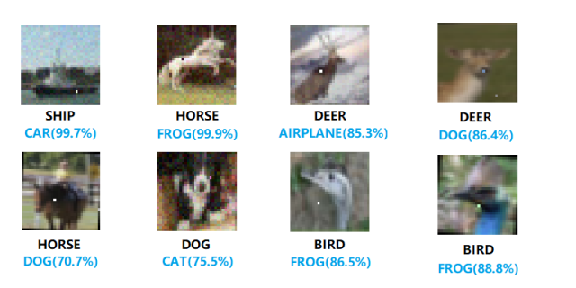
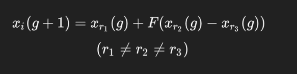
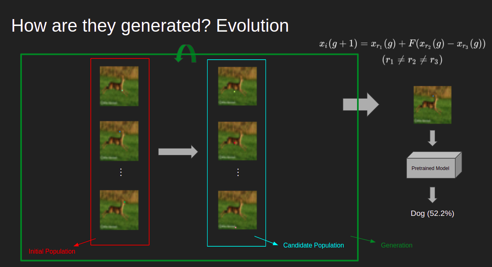

# Exploring One-Pixel-Attacks

[]

Implementing one pixel attacks on various pretrained neural network models. In this repository, I explore the one-pixel-attack and analyze its effect on pretrained models.

## Contents
- [Introduction](#introduction)
- [Attack-Overview](#attack-overview)
- [Colab-File](#colab-file)
- [Resources](#resources)

## Introduction
In this work, we explore the one-pixel-attack. A one-pixel-attack is a black-box attack that by perturbing a single pixel of the image, manages to fool a pretrained neural network model to misclassify the image (often with high confidence!). This attack is generated via Differential Evolution (DE). Our results show that on average, about 1/3 of the total images under all models are successfully misclassified. Other information on this attack are:
- Dataset: CIFAR-10 dataset
- Models: Pure CNN, ResNet, DenseNet, CapsNet, WideResNet
- Evolutionary algorithm: Differential Evolution
- Evaluation Metric: Success rate (# of sucessful attacks / # of total attacks)

## Attack Overview
The way the attack is generated is as follows: First, we generate an initial population of one-pixel-perturbed images of the targeted image. After generating the initial population, we generate the candidate (children) population. Since this algorithm is a differential evolution algorithm, the child generation formula will be:

<br />

[]

<br />

Now the parents and the children will compete according to the fitness function. In our setup, the fitness function will be to either minimize the correct class label (untargeted attack) or to maximize the target class label (targeted attack). This signifies the execution of one generation. This process will then continue until we generate the perturbed image which misclassifies the model. A flowchart of this process is depicted below

<br />

[]

<br />

## Colab File
The main segments of the [notebook](https://colab.research.google.com/drive/1yi0JfuOcXfPyfaDJQKacY59XRdRMaFl_?usp=sharing) are:
- Imports and Extracts: importing the necessary libraries and retrieving the pretrained models.
- Warm Up: just importing the models and loading the dataset. Nothing special! 
- Initial Experiments: here we test the attack on random pixel perturbations, in order to get a feel of the attack.
- Differential Evolution: implementing the differential evolution algorithm for our purpose (we use scipy's differential evolution library, because it makes things much easier).
- Testing on all models: scaling the attack to be performed on all models.
- Analyzing: analyzing the gathered data.
- Going Even Further: A short glimpse into shared vulnerabilities between neighboring pixels.

## Minor Issue
Through the imports, make sure to make the following modifications:
```python
from tensorflow.keras.optimizers import Adam, SGD
from tensorflow.keras.layers import BatchNormalization
from tensorflow.keras.utils import plot_model
from tensorflow.keras.utils import to_categorical
```

## Resources
- [One pixel attack for fooling deep neural networks](https://arxiv.org/abs/1710.08864)
- [Understanding the one-pixel attack: Propagation maps and locality analysis](https://arxiv.org/abs/1902.02947)
- [Explaining and harnessing adversarial examples](https://arxiv.org/abs/1412.6572)
- [Adversarial examples in modern machine learning: A review](https://arxiv.org/abs/1911.05268)
- [Intriguing properties of neural networks](https://arxiv.org/abs/1312.6199)
